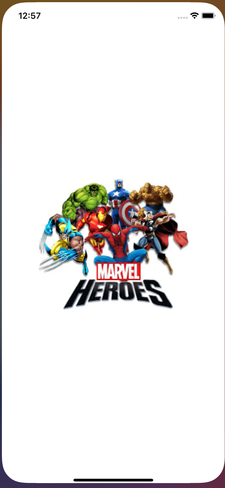
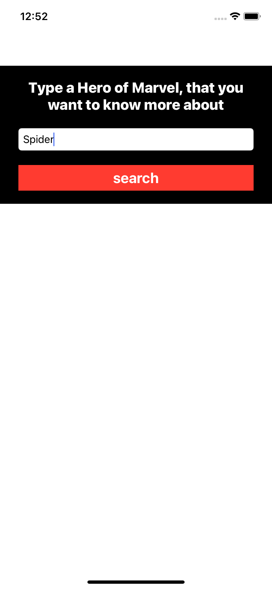
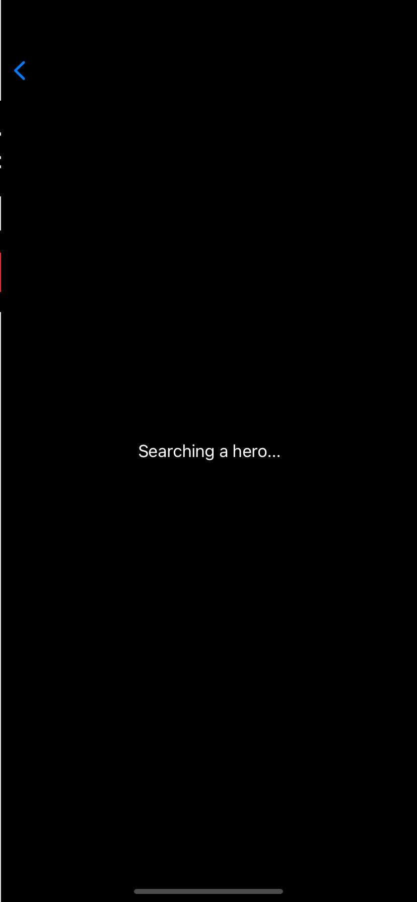
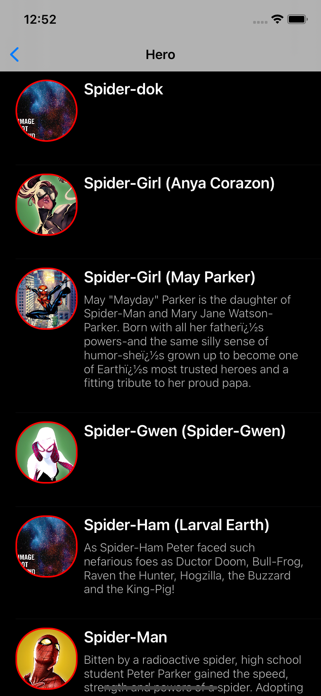
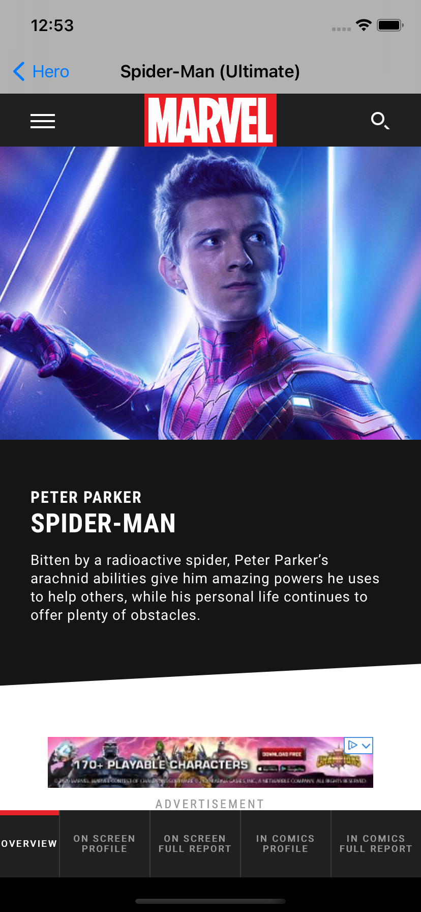

# Como fazer um README.md

# Introdução
- Fale sobre o seu projeto e o que usou para desenvolver ele. 
Ex.: Esse app foi desenvolvido para praticar.
    - Arquiteutura utilizada [MVC](https://www.devmedia.com.br/introducao-ao-padrao-mvc/29308)
    - Bibliotecas internas:
      - [Codable](https://developer.apple.com/documentation/foundation/archives_and_serialization/encoding_and_decoding_custom_types)
    - Bibliotecas Externas:
      - [Alamofire](https://github.com/Alamofire/Alamofire)
      - [KingFisher](https://github.com/onevcat/Kingfisher)
      - [SwiftHash](https://github.com/onmyway133/SwiftHash)

# Requirimentos para excecutar a aplicação
- Explique o que é necessário para permitir que ele funcione corretamente no Device ao qual a pessoal ira abrir. 
Ex.: Antes de abrir o app na máquina, é necessário:
    - Xcode 11.5 ou superior. 
    - Ter o cocoapods instalado.()
Depois de instalar, abra a pasta do projeto e digite o comando:
 - pod install

# Screenshots e uso
- Prints, Gifs e vídeos são super recomendados aqui. Falar sobre o funcionamento dele também. 
Ex.: Na primeira tela do app é exibido um campo onde permite pesquisar um Herói da API [MARVEL](https://developer.marvel.com/):
- Após pesquisar um herói será exibida na TableView uma lista com os heróis que possuam o nome pesquisado, caso contrário exibirá e mensagem "Hero, not found".

# Observações
- Informações ou observações extras. 
Ex.: Esse aplicativo foi desenvolvido por [@leticiafaleia](https://github.com/leticiafaleia) - através do curso do professor [Eric Brito](https://www.udemy.com/course/curso-completo-de-desenvolvimento-ios11swift4).
